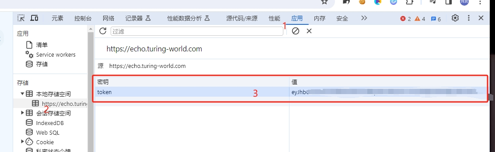

# Emohaa AI Free 服务


支持高速流式输出、支持多轮对话，零配置部署，多路token支持，自动清理会话痕迹。

与ChatGPT接口完全兼容。

## 目录

* [声明](#声明)
* [在线体验](#在线体验)
* [接入准备](#接入准备)
  * [多账号接入](#多账号接入)
* [Docker部署](#Docker部署)
  * [Docker-compose部署](#Docker-compose部署)
* [原生部署](#原生部署)
* [接口列表](#接口列表)
  * [对话补全](#对话补全)
* [注意事项](#注意事项)
  * [Nginx反代优化](#Nginx反代优化)

## 声明

仅限自用，禁止对外提供服务或商用，避免对官方造成服务压力，否则风险自担！

仅限自用，禁止对外提供服务或商用，避免对官方造成服务压力，否则风险自担！

仅限自用，禁止对外提供服务或商用，避免对官方造成服务压力，否则风险自担！

## 在线体验

此链接仅临时测试功能，不可长期使用，长期使用请自行部署。

https://udify.app/chat/LDgsbVTfyTQ000Oq

## 接入准备

从 [echo.turing-world.com](https://echo.turing-world.com/) 获取token

登录进入然后F12打开开发者工具，从Application > Local Storage中找到`token`的值，这将作为Authorization的Bearer Token值：`Authorization: Bearer TOKEN`



### 多账号接入

你可以通过提供多个账号的token并使用`,`拼接提供：

`Authorization: Bearer TOKEN1,TOKEN2,TOKEN3`

每次请求服务会从中挑选一个。

## Docker部署

请准备一台具有公网IP的服务器并将8000端口开放。

拉取镜像并启动服务

```shell
docker run -it -d --init --name emohaa-free-api -p 8000:8000 -e TZ=Asia/Shanghai vinlic/emohaa-free-api:latest
```

查看服务实时日志

```shell
docker logs -f emohaa-free-api
```

重启服务

```shell
docker restart emohaa-free-api
```

停止服务

```shell
docker stop emohaa-free-api
```

### Docker-compose部署

```yaml
version: '3'

services:
  emohaa-free-api:
    container_name: emohaa-free-api
    image: vinlic/emohaa-free-api:latest
    restart: always
    ports:
      - "8000:8000"
    environment:
      - TZ=Asia/Shanghai
```

## 原生部署

请准备一台具有公网IP的服务器并将8000端口开放。

请先安装好Node.js环境并且配置好环境变量，确认node命令可用。

安装依赖

```shell
npm i
```

安装PM2进行进程守护

```shell
npm i -g pm2
```

编译构建，看到dist目录就是构建完成

```shell
npm run build
```

启动服务

```shell
pm2 start dist/index.js --name "emohaa-free-api"
```

查看服务实时日志

```shell
pm2 logs emohaa-free-api
```

重启服务

```shell
pm2 reload emohaa-free-api
```

停止服务

```shell
pm2 stop emohaa-free-api
```

## 接口列表

目前支持与openai兼容的 `/v1/chat/completions` 接口，可自行使用与openai或其他兼容的客户端接入接口，或者使用 [dify](https://dify.ai/) 等线上服务接入使用。

### 对话补全

对话补全接口，与openai的 [chat-completions-api](https://platform.openai.com/docs/guides/text-generation/chat-completions-api) 兼容。

**POST /v1/chat/completions**

header 需要设置 Authorization 头部：

```
Authorization: Bearer [refresh_token]
```

请求数据：
```json
{
    "messages": [
        {
            "role": "user",
            "content": "你好"
        }
    ],
    // 如果使用SSE流请设置为true，默认false
    "stream": false
}
```

响应数据：
```json
{
    "id": "f73f02e6-6b43-4a46-ac24-3a9ea8d15145",
    "model": "emohaa",
    "object": "chat.completion",
    "choices": [
        {
            "index": 0,
            "message": {
                "role": "assistant",
                "content": " 你好啊！我是Emohaa，想和我聊点什么吗？ 今天心情如何？"
            },
            "finish_reason": "stop"
        }
    ],
    "usage": {
        "prompt_tokens": 0,
        "completion_tokens": 0,
        "total_tokens": 0
    },
    "created": 1710603111
}
```

## 注意事项

### Nginx反代优化

如果您正在使用Nginx反向代理kimi-free-api，请添加以下配置项优化流的输出效果，优化体验感。

```nginx
# 关闭代理缓冲。当设置为off时，Nginx会立即将客户端请求发送到后端服务器，并立即将从后端服务器接收到的响应发送回客户端。
proxy_buffering off;
# 启用分块传输编码。分块传输编码允许服务器为动态生成的内容分块发送数据，而不需要预先知道内容的大小。
chunked_transfer_encoding on;
# 开启TCP_NOPUSH，这告诉Nginx在数据包发送到客户端之前，尽可能地发送数据。这通常在sendfile使用时配合使用，可以提高网络效率。
tcp_nopush on;
# 开启TCP_NODELAY，这告诉Nginx不延迟发送数据，立即发送小数据包。在某些情况下，这可以减少网络的延迟。
tcp_nodelay on;
# 设置保持连接的超时时间，这里设置为120秒。如果在这段时间内，客户端和服务器之间没有进一步的通信，连接将被关闭。
keepalive_timeout 120;
```